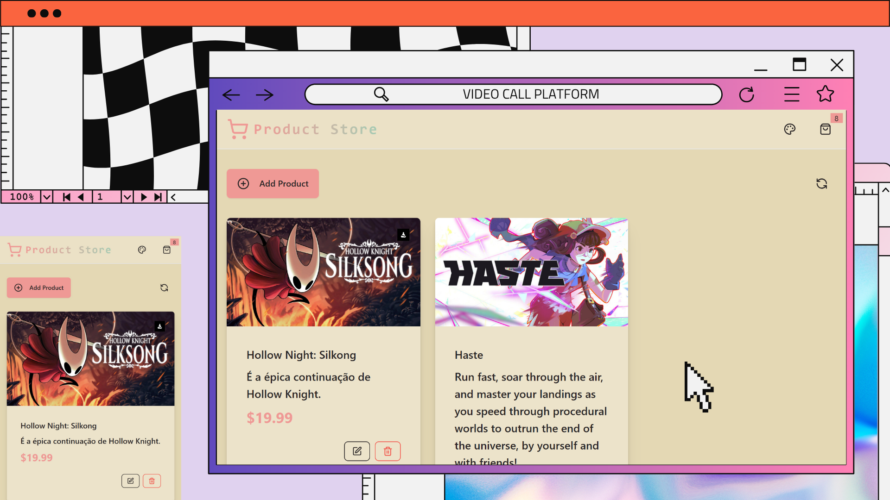
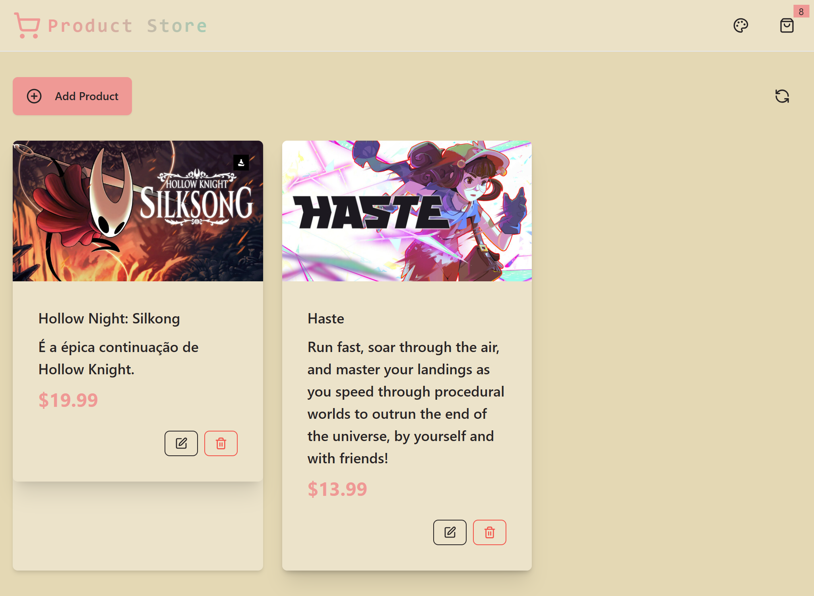
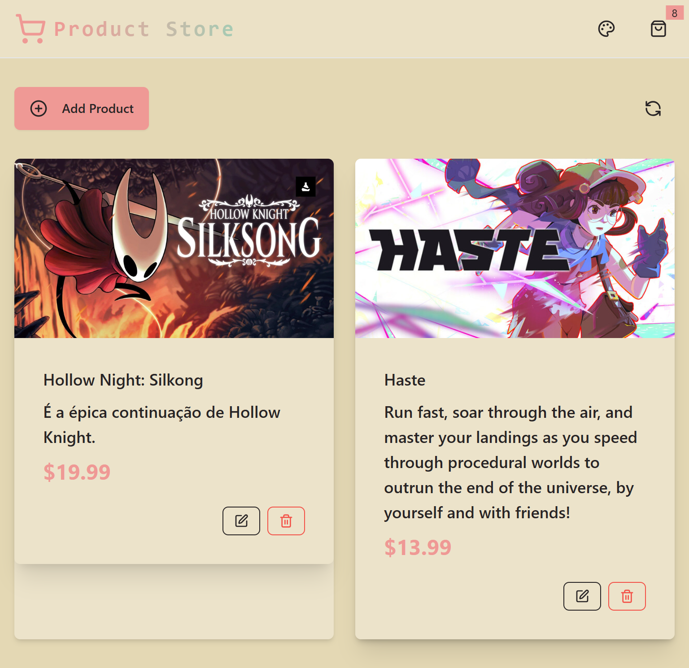
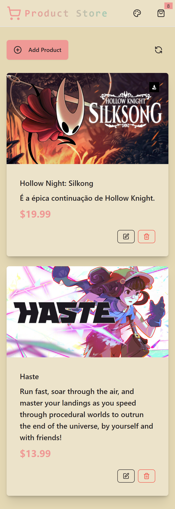

# 💼 Product Store
> Um CRUD moderno e escalável utilizando a stack PERN, estilizado com TailwindCSS e DaisyUI..

---

## 🚀 Demonstração
🔗 **Acesse o projeto:** [link-do-deploy-aqui](https://product-store-ir63.onrender.com/)  

📸 **Preview:**  


---

## 📚 Sumário
- [Sobre o Projeto](#-sobre-o-projeto)
- [Tecnologias](#️-tecnologias)
- [Funcionalidades](#-funcionalidades)
- [Como Rodar o Projeto](#-como-rodar-o-projeto)
- [Como Usar](#-como-usar)
- [Screenshots](#️-screenshots)
- [Aprendizados](#-aprendizados)
- [Estrutura de Pastas](#-estrutura-de-pastas)
- [Roadmap](#-roadmap)
- [Links Úteis](#-links-úteis)
- [Autor](#-autor)
- [Licença](#-licença)

---

## 💡 Sobre o Projeto
Este site foi desenvolvido para **aprimorar, minhas habilidades** na área de desenvolvimento.  
A interface foi construída com **React, Node.js, postgreSQL e tailwind**, com foco em **design moderno, responsividade e performance**.

---

## 🛠️ Tecnologias
As principais tecnologias utilizadas neste projeto foram:

- **React**
- **Node.js** (Criando rotas e servidor para os processos)
- **PostgreSQL** (banco de dados)
- **Tailwind** (estilizações da página)
- **DaisyUI** (criação de UI's e estilizações dinâmicas e responsivas)

<div align="right">
  
  
  
  
  
  
  
</div>
---

## 📚 Funcionalidades
- [x] Criar, listar, atualizar e excluir registros (CRUD completo)
- [x] Feedback visual para erros e requisições
- [x] Proteção contra bots e abuso de API
- [x] Integração entre frontend e backend via REST

---

## 📦 Como Rodar o Projeto
Siga as etapas abaixo para executar o projeto localmente:

```bash
    # Crie um arquivo .env.local na raiz do projeto com as variáveis necessárias:
    PORT=3000
    PGUSER=...
    PGPASSWORD=...
    PGHOST=...
    PGDATABASE=...
    ARCJET_KEY=...
    ARCJET_ENV=development
```

```bash
# Clone este repositório
git clone https://github.com/joao-enrique/Product-Store.git

# Acesse a pasta do projeto
cd Product-store

# Instale as dependências
npm install
#rode o banco de dados na porta 3000
npm run start
# rode a aplicação
npm run dev
```
O frontend estará disponível em: http://localhost:5173 (ou a porta definida pelo Vite)
> 💡 Caso não tenha o Node.js instalado, procure no google e siga os passos para sua instalação.

---

## 🧪 Como Usar
1. Instale as dependências com o `node.js`.
2. Navegue pelo projeto.
3. Crie, Edite, leia ou remova produtos ou qualquer coisa dentro do site.

---

## 🖼️ Screenshots
### 💻PC

### 📲 Tablet

### 📱 Mobile


---

## 🧠 Aprendizados
Durante o desenvolvimento deste projeto, aprimorei:
- Criação de rotas e servidor com `Node.js`;
- Uso de tailwindCSS com DaisyUI para criação de um site responsivo e com uma boa UI;
- Uso de estados no `React.js`;
- Melhoria na estrutura de layout responsivo;
- Integração de `PostgreSQL` com `Node.js` para armazenar informações e criar rotas (produtos, método de comsumo).

---

## 📁 Estrutura de Pastas
├── backend/ </br>
├── frontend/ </br>
├── images/ </br>
├── .env.example</br>
└── README.md </br>
---

## 🚧 Roadmap
- [] Implementar formas de pagamentos
- [] Checkout
- [] Traduzir para versão em Português
- [] Melhorar Navbar
- [] Descrição do produto
- [] Autenticação de Usuários(e só ele pode remover criar ou editar a tarefa dele)

---

## 🔗 Links Úteis
🌐 Deploy: [link](https://meu-portfolio-lemon-sigma.vercel.app/)  </br>
💼 LinkedIn: [link](https://www.linkedin.com/in/joao-enrique-dev/) </br>
🧠 GitHub: [link](https://github.com/joao-enrique) </br>
🎮 Itch-io: [link](https://jedev1.itch.io/) </br>
📹 YouTube: [link](https://www.youtube.com/@joaocodedev) </br>
✨ Linktree: [link](https://linktree-eight-gules.vercel.app/) </br>

## 👨‍💻 Autor
Feito com 💜 por [João Enrique](https://linktree-eight-gules.vercel.app/)
<div align="right">
  <a href="https://www.linkedin.com/in/joao-enrique-dev/" target="_blank">
    
  </a>
  <a href="https://www.youtube.com/@joaocodedev" target="_blank">
    
  </a>
  <a href="https://jedev1.itch.io/" target="_blank">
    
  </a>
</div>

---

## 📜 Licença
Este projeto está sob a licença **MIT** — veja o arquivo [LICENCE](./LICENSE) para mais detalhes.

### ⭐ Se este projeto te inspirou, não esqueça de deixar uma **estrela** no repositório!